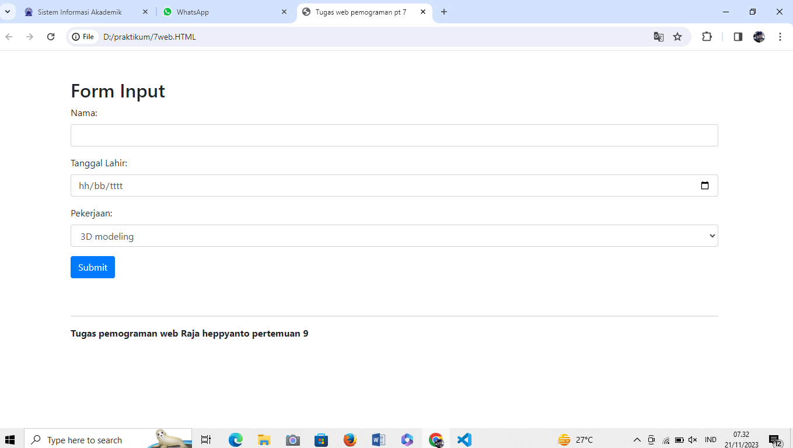

# lab7web

```
nama : m ryamizard r s
TI22A2
```
## Daftar isi
```
Tugas
```
```
code:
<!DOCTYPE html>
<html lang="en">
<head>
    <meta charset="UTF-8">
    <meta name="viewport" content="width=device-width, initial-scale=1, shrink-to-fit=no">
    <title>Tugas web pemograman pt 7</title>

    <link href="https://stackpath.bootstrapcdn.com/bootstrap/4.5.2/css/bootstrap.min.css" rel="stylesheet">
</head>
<body class="container mt-5">
    <h2>Form Input</h2>
    <form method="post">
        <div class="form-group">
            <label for="nama">Nama:</label>
            <input type="text" class="form-control" name="nama" required>
        </div>

        <div class="form-group">
            <label for="tgl_lahir">Tanggal Lahir:</label>
            <input type="date" class="form-control" name="tgl_lahir" required>
        </div>

        <div class="form-group">
            <label for="pekerjaan">Pekerjaan:</label>
            <select class="form-control" name="pekerjaan" required>
                <option value="3D modeling">3D modeling</option>
                <option value="freelancer">freelancer</option>
                <option value="kuli">kuli</option>
            </select>
        </div>

        <button type="submit" class="btn btn-primary">Submit</button>
    </form>
    <br>
    <br>
    <hr class="border-bottom">

    <p class="text-left font-weight-bold ">Tugas pemograman web Raja heppyanto pertemuan 9</p>

</body>
</html>
```



